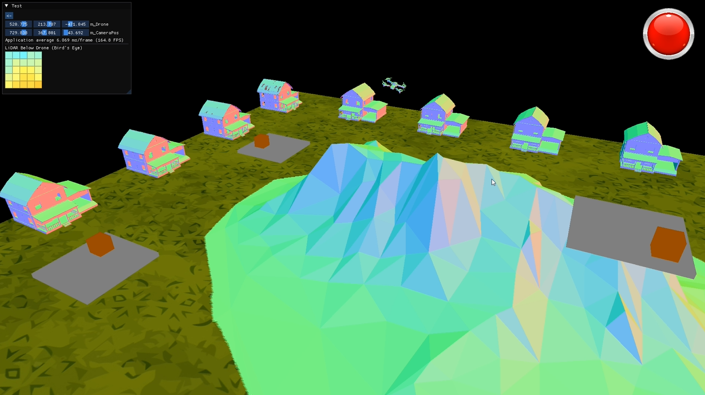

<!-- LOGO -->
<br />
<h1>
<p align="center">
  
  <br>
</h1>
  <p align="center">
    Real-time drone guidance simulation with OpenGL + ML-based safe-zone detection
    <br />
    </p>
</p>
<p align="center">
  • <a href="#about-the-project">About The Project</a> •
  <a href="#quick-start">Quick Start</a> •
  <a href="#manually-build">Build</a> •
  <a href="#usage">How to Use</a> •
  <a href="#planned-features">Planned Features</a> •
  <a href="#acknowledgements">Acknowledgements</a> •
</p>  

<p align="center">
 

</p>                                                                                                                             
                                                                                                                                                      
## About The Project 
This project is a drone flight simulator built with an OpenGL framework and a Docker-powered ML guidance server. It simulates LiDAR scanning of generated topographies and autonomous navigation, allowing testing of guidance systems before real-world deployment (e.g. last-mile delivery). The simulation includes an emergency landing protocol, with in-flight collision detection currently under development.

<a id="quick-start"></a>
## Quick Start 🚀

<a id="manually-build"></a>
## Manually Build 🛠️

Requirements (must be on PATH):
- CMake 3.16 - 3.31
- C++17 or later
- Git
- Python 3.8 - 3.11
- pip
- meson (installed via pip)
- ninja (installed via pip)

Additional tools/runtime (PATH not required):
- Docker
- OpenGL runtime (provided by GPU manufacturer)

Clone from GitHub:
```
git clone https://github.com/krmiller678/OpenGL_Drone_ML <my-directory>
cd <my-directory>
```

Install Dependencies:  
```bash
pip install meson ninja
```

Run CMake from cloned directory:  
```bash
mkdir build && cd build
cmake ..
cmake --build .
```

A few notes on deploying your own build:
- Docker engine must be running prior to launching the application.
- After the Docker image is built, ml_image_built.stamp will be added to build directory. To modify the Docker image and have it rebuild, delete the stamp.
- The Docker container will automatically be deleted after being stopped.

## Usage
### CMake Commands
*Run from build directory*
```bash
cmake --build . --target drone_sim      # build simulation only
cmake --build . --target ml-build       # build ML Docker image only
cmake --build . --target ml-run         # run ML Docker container
cmake --build . --target ml-stop        # stop ML Docker container
cmake --build . --target run-all        # build and run both simulation + ML container
cmake --build . --target clean-all      # cleanup everything
```

### Input/Output
- **Single-Click** 
- **Double-Click**
### On Screen Buttons
- **EXAMPLE** 

### Screen Elements
- **EXAMPLE**

**NOTE:** 

## Planned Features
- [X] Manually engage emergency landing protocol 
- [ ] Generated Topography feature
- [ ] Import City Scapes feature
- [ ] Select your Machine Learning Landing Algorithm
- [ ] Fuel level with automatic emergency landing
- [ ] In-flight collision detection

## Acknowledgements
- The Cherno OpenGL in C++ series https://www.youtube.com/playlist?list=PLlrATfBNZ98foTJPJ_Ev03o2oq3-GGOS2
- GLFW for window creation https://www.glfw.org/download.html
- GLEW (OpenGL Extension Wrangler) https://glew.sourceforge.net/basic.html
- https://docs.gl/
- https://learnopengl.com/
- https://github.com/nothings/stb/blob/master/stb_image.h for 2d textures
- glm for math https://github.com/g-truc/glm
- ImGui for GUI https://github.com/ocornut/imgui
- https://github.com/nlohmann/json.git for json
- https://github.com/libcpr/cpr.git for cURL / HTTP
- https://www.mdpi.com/2072-4292/13/10/1930
- https://www.mdpi.com/2079-9292/14/10/2026
- https://www.sciencedirect.com/science/article/pii/S0952197623008151
- https://arxiv.org/abs/1705.05065
- https://arxiv.org/abs/2502.05038
- https://ntrs.nasa.gov/citations/20180008439
- https://medium.com/@itberrios6/introduction-to-point-net-d23f43aa87d2
- https://arxiv.org/pdf/1612.00593